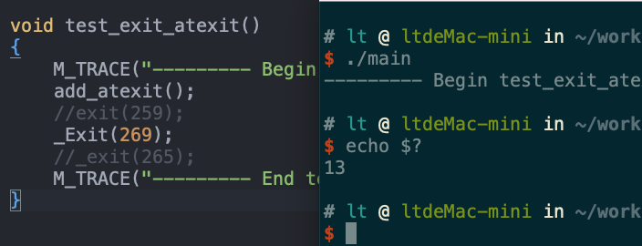
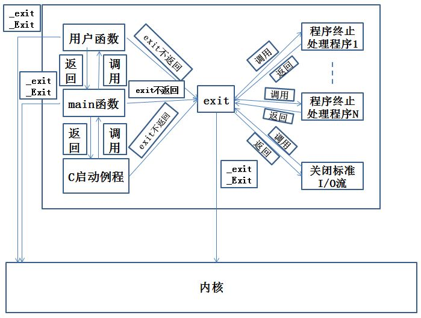
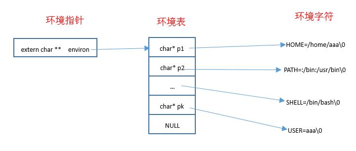

# 进程环境

## 进程相关

1. C程序总是从`main`函数开始执行的。`main`函数的原型是：
```
    int main(int argc, char * argv[])
```
- 参数:
    - `argc`: 命令行参数的数目
    - `argv`: 由指向各命令行参数的指针所组成的数组。`ISO
      C`和`POSIX.1`都要求`argv[argc]`是一个空指针。

当内核执行C程序时，在调用`main`之前先调用一个特殊的启动例程。
- 内核执行C程序是通过使用一个`exec`函数实现的
- 可执行程序文件将此启动例程指定为程序的起始地址（这是由链接器设置的，而链接器由C编译器调用）
- 启动例程从内核取得命令行参数和环境变量值，然后为调用`main`函数做好安排

2. 有8种方式使进程终止（termination）,其中5种为正常终止，3种异常方式：
    - 正常终止方式：
        - 从`mian`返回
        - 调用`exit`函数
        - 调用`_exit`函数或`_Exit`函数
        - 多线程的程序中，最后一个线程从其启动例程返回
        - 多线程的程序中，从最后一个线程调用`pthread_exit`函数
    - 异常终止方式：
        - 调用`abort`函数
        - 接收到一个信号
        - 多线程的程序中，最后一个线程对取消请求作出响应

3. 当内核执行 C
程序时，在调用`main`之前先调用一个启动例程。该启动例程是这样编写的：从`main`返
回后立即调用`exit`函数。其形式`exit(main(argc,argv))`。
    > 实际上启动例程通常是汇编语言写的

4. `exit/_Exit/_exit`函数：正常终止一个程序。

    ```
    #include <stdlib.h>
    void exit (int status);
    void _Exit (int status);
    #include <unistd.h>
    void _exit (int status);
    ```
    
    - 参数：`status`:终止参数

    上述三个退出函数的区别：
    - `_exit`和`_Exit`函数：立即进入内核
    - `exit`函数：先执行一些清理函数，然后进入内核
    - `exit`和`_Exit`函数是由`ISO C`说明的，`_exit`函数是由`POSIX`说明的

    > 清理：exit函数总是执行一个标准 I/O 库的清理关闭操作：对于所有打开流调用 fclose 函数。 

    注意：
    - 上述 3 个函数都带一个整型参数，称为终止状态（或称作退出状态）。大多数 UNIX 系统 shell 都提供检查进程终止状态的方法。
        - 若调用上述 3 个函数时不带终止参数，则该进程的终止状态是未定义的
        - 若`main`执行了一个无返回值的`return`语句，则该进程的终止状态是未定义的 
        - 若`main`没有声明返回类型为整型，则该进程的终止状态是为定义的
        - 若`main`声明返回类型为整型，并且`main`执行到最后一条语句时返回（隐式返回），则该进程的终止状态是 0

    - `main`函数返回一个整型值与该值调用`exit`是等价的。即`main`函数中，`exit(100);`等价与 `return 100;`
    - 在 Linux 中，退出状态码最高是255，一般自定义的代码值为 0~255，如果超出255，则返回值数值被256求余

5. `atexit`函数：登记`exit`函数调用的清理函数

    ```
    #include <stdlib.h>
    int atexit(void (*func)(void));
    ```

    - 参数：
        - `func`: 函数指针。它指向的函数的原型是：返回值为`void`，参数为`void`
    - 返回值：
        - 成功：返回 0
        - 失败：返回非 0

    一个进程可以登记最多 32 个函数，这些函数将由`exit`函数自动调用。这些函数称
    作终止处理程序（`exit handler`）。而`atexit`函数就是登记`exit handler`的
    - `eixt`调用这些`exit handler`的顺序与它们登记的时候顺序相反
    - 如果同一个`exit handler` 被等级多次，则它们也会调用多次
    > 通常操作系统会提供多余 32 个`exit > handler`的限制。可以用`sysconf`函数查询这个限制值


6. 示例：在`main`函数中调用`test_exit_atexit`函数：

    ```
    void test_exit_atexit()
    {
        M_TRACE("--------- Begin test_exit_atexit() ---------\n");
        add_atexit();
        //exit(258);
        _Exit(269);
        //_exit(265);
        M_TRACE("--------- End test_exit_atexit() ----------\n");
    }
    ```

    可以看到：
    - 终止处理程序`exit handler` 调用顺序是逆序的
    - 终止处理程序`exit handler` 多次注册则调用多次
    - 退出码是除以256的余数

    

    如果将`exit(258);`替换成`_Exit(269)`，则：
    - 不会再调用终止程序`exit handler`
    

7. C 程序的启动和终止
    - `exit` 函数首先调用各终止处理函数，然后关闭（通过 fclose）所有打开流。
    - 内核使程序执行的唯一方法是调用一个`exec`函数
    - 进程自愿终止的唯一方法是显示或隐式地（通过调用`exit`）调用`_exit`或`_Exit`

    

8. 每个进程都会接收一张环境表。
    - 与参数表一样，环境表也是一个字符指针数组
        - 其中数组中的每个指针指向一个以 null 结束的 C 字符串，这些字符串称之为环境字符串
        - 数组最后一项是 `NULL`
    - 全局变量`envrion`包含了该指针数组的地址：`extern char **envrion;`，称 envrion 为环境指针（envrionment pointer）
    - 按照惯例，环境由 `name = value` 这样的字符串组成

    

9. C 程序的存储空间布局：C 程序一直由下列几部分组成：
    - 正文段：这是由 CPU 执行的机器指令部分
        - 通过正文段可以共享的。一个程序的可以同时执行`N`次，但是该程序的正文段在内存中只需要有一份而不是`N`份
        - 通常正文段是只读的，以防止程序由于意外而修改其指令
    - 初始化数据段：通常将它称作数据段
        - 它包含了程序中明确的赋了初值的变量：包含函数外的赋初值的全局变量，函数内的赋初值的静态变量
    - 未初始化数据段：通常称作`bss`段。在程序开始执行之前，内核将此段中的数据初始化为 0 或 空指针
        - 它包含了程序中未赋初值的变量：包括函数外的未赋初值的全局变量、函数内的未赋初值的静态变量
    - 栈段：临时变量以及每次函数调用时所需要保存的信息都存放在此段中
        - 每次函数调用时，函数返回地址以及调用者的环境信息（如某些CPU 寄存器的值）都存放在栈中
        - 最新的正被执行的函数，在栈上为其临时变量分配存储空间
        > 通过这种方式使用栈，C 递归函数可以工作。递归函数每次调用自身时，就创建一个新的栈帧，因此某一次函数调用中的变量不影响下一次调用中的变量
    - 堆段：通常在堆中进行动态存储分配
        - 由于历史习惯，堆位于未初始化数据段和栈段之间

    

    注意：
    - 栈从高地址向低地址增长。堆顶和栈顶之间未使用的虚拟地址空间很大
    - 未初始化数据段的内容并不存放在磁盘程序文件中。需要存放在磁盘程序文件中的段只有正文段和初始化数据段
        > 因为内核在程序开始运行前将未初始化数据段置为 0
    - `size` 命令可以查看程序的正文段、数据段和`bss`段长度（以字节为单位）


10. `malloc/calloc/realloc`函数：动态分配存储空间

    ```
    #include <stdlib.h>
    void *malloc(size_t size);
    void *calloc(size_t nobj, size_t size);
    void *realloc(void *ptr, size_t newsize);
    ```

    - 参数：
        
        对于`malloc`函数：
        - `size`：动态分配的存储空间的大小（字节数）

        对于`calloc`函数：
        - `nobj`：动态分配的对象的数量
        - `size`：每个对象的大小（字节数）

        对于`realloc`函数：
        - `ptr`：由`malloc/realloc`返回的指针，指向一个动态分配的空间
            - 如果`ptr`为 NULL，则`realloc` 与`malloc`功能相同
        - `newsize`：调整后的动态空间的大小（字节数）

    - 返回值：
        - 成功：返回非空指针
        - 失败：返回 NULL

    注意：
    - 这三个分配函数所返回的指针一定是适当对齐的，使其可以用于任何数据对象
    - `realloc`可以增加、减少之前分配的动态存储区长度。对于增加动态存储区的情况：
        - 如果在原来动态存储区位置后面有足够的空间可以扩充，则可以在原存储区位置上向高地址扩充，无需移动任何原先的内容，并返回与传给它相同的指针值
        - 如果在原来动态存储区位置后面有足够的空间可以扩充，则可以在原存储区位置上向高地址扩充，无需移动任何原先的内容，并返回与传给它相同的指针值
    - 这些分配函数通常使用`sbrk`系统调用实现。该系统调用用于扩充或缩小进程的堆空间
        - 大多数实现所分配的存储空间要比所要求的稍大一些，额外的空间用来记录管理信息，比如分配块的长度、指向下一个分配块的指针等等。
        - 因此在一个动态分配区的尾部之后或者在起始位置之前写操作会修改另一块的管理记录信息。这种类型的错误是灾难性的，但是由于这种错误不会立即暴露出来，因此很难被发现

    - 这三个函数返回的动态分配区必须用`free()`函数进行释放
        - 如果一个进程调用了`malloc`函数但是没有调用`free`函数，则该进程占用的存储空间就会连续增加，这称作内存泄漏
        - 内存泄漏会导致进程地址空间长度慢慢增加到不再有空闲空间。此时过度的换页开销会导致性能下降
    - 对一块动态分配的内存，只能`free`一次。如果`free`多次则会发生错误

