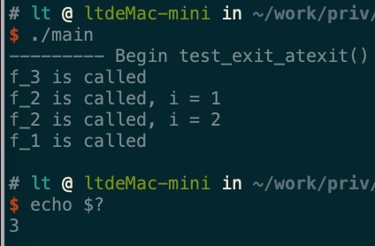

# 进程环境

## 进程相关

1. C程序总是从`main`函数开始执行的。`main`函数的原型是：
```
    int main(int argc, char * argv[])
```
- 参数:
    - `argc`: 命令行参数的数目
    - `argv`: 由指向各命令行参数的指针所组成的数组。`ISO
      C`和`POSIX.1`都要求`argv[argc]`是一个空指针。

当内核执行C程序时，在调用`main`之前先调用一个特殊的启动例程。
- 内核执行C程序是通过使用一个`exec`函数实现的
- 可执行程序文件将此启动例程指定为程序的起始地址（这是由链接器设置的，而链接器由C编译器调用）
- 启动例程从内核取得命令行参数和环境变量值，然后为调用`main`函数做好安排

2. 有8种方式使进程终止（termination）,其中5种为正常终止，3种异常方式：
    - 正常终止方式：
        - 从`mian`返回
        - 调用`exit`函数
        - 调用`_exit`函数或`_Exit`函数
        - 多线程的程序中，最后一个线程从其启动例程返回
        - 多线程的程序中，从最后一个线程调用`pthread_exit`函数
    - 异常终止方式：
        - 调用`abort`函数
        - 接收到一个信号
        - 多线程的程序中，最后一个线程对取消请求作出响应

3. 当内核执行 C
程序时，在调用`main`之前先调用一个启动例程。该启动例程是这样编写的：从`main`返
回后立即调用`exit`函数。其形式`exit(main(argc,argv))`。
    > 实际上启动例程通常是汇编语言写的

4. `exit/_Exit/_exit`函数：正常终止一个程序。

    ```
    #include <stdlib.h>
    void exit (int status);
    void _Exit (int status);
    #include <unistd.h>
    void _exit (int status);
    ```
    
    - 参数：`status`:终止参数

    上述三个退出函数的区别：
    - `_exit`和`_Exit`函数：立即进入内核
    - `exit`函数：先执行一些清理函数，然后进入内核
    - `exit`和`_Exit`函数是由`ISO C`说明的，`_exit`函数是由`POSIX`说明的

    > 清理：exit函数总是执行一个标准 I/O 库的清理关闭操作：对于所有打开流调用 fclose 函数。 

    注意：
    - 上述 3 个函数都带一个整型参数，称为终止状态（或称作退出状态）。大多数 UNIX 系统 shell 都提供检查进程终止状态的方法。
        - 若调用上述 3 个函数时不带终止参数，则该进程的终止状态是未定义的
        - 若`main`执行了一个无返回值的`return`语句，则该进程的终止状态是未定义的 
        - 若`main`没有声明返回类型为整型，则该进程的终止状态是为定义的
        - 若`main`声明返回类型为整型，并且`main`执行到最后一条语句时返回（隐式返回），则该进程的终止状态是 0

    - `main`函数返回一个整型值与该值调用`exit`是等价的。即`main`函数中，`exit(100);`等价与 `return 100;`
    - 在 Linux 中，退出状态码最高是255，一般自定义的代码值为 0~255，如果超出255，则返回值数值被256求余

5. `atexit`函数：登记`exit`函数调用的清理函数

    ```
    #include <stdlib.h>
    int atexit(void (*func)(void));
    ```

    - 参数：
        - `func`: 函数指针。它指向的函数的原型是：返回值为`void`，参数为`void`
    - 返回值：
        - 成功：返回 0
        - 失败：返回非 0

    一个进程可以登记最多 32 个函数，这些函数将由`exit`函数自动调用。这些函数称
    作终止处理程序（`exit handler`）。而`atexit`函数就是登记`exit handler`的
    - `eixt`调用这些`exit handler`的顺序与它们登记的时候顺序相反
    - 如果同一个`exit handler` 被等级多次，则它们也会调用多次
    > 通常操作系统会提供多余 32 个`exit > handler`的限制。可以用`sysconf`函数查询这个限制值


6. 示例：在`main`函数中调用`test_exit_atexit`函数：

    ```
    void test_exit_atexit()
    {
        M_TRACE("--------- Begin test_exit_atexit() ---------\n");
        add_atexit();
        //exit(258);
        _Exit(269);
        //_exit(265);
        M_TRACE("--------- End test_exit_atexit() ----------\n");
    }
    ```

    可以看到：
    - 终止处理程序`exit handler` 调用顺序是逆序的
    - 终止处理程序`exit handler` 多次注册则调用多次
    - 退出码是除以256的余数

    
