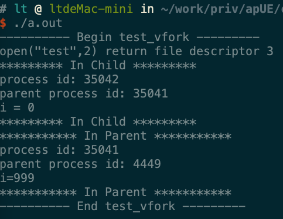
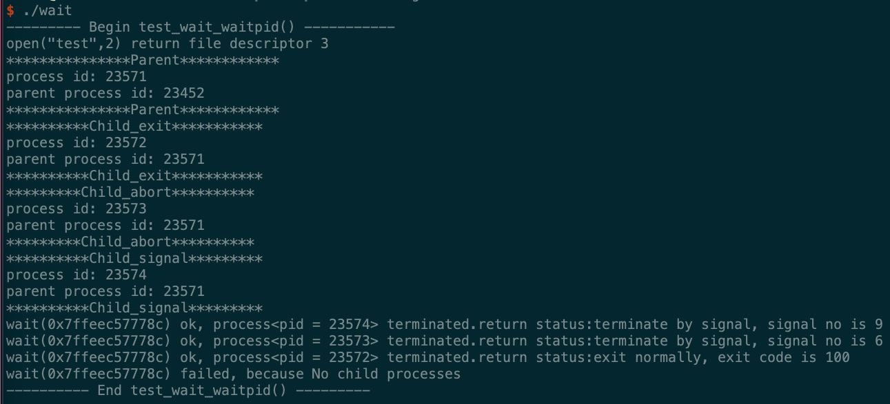

# 进程控制

## 进程的创建

1. 每个进程都有一个非负整型表示的唯一进程 ID 。
    - 所谓的唯一，即当前正在系统中运行的所有进程`ID` 各不相同。
    - 当一个进程`A`终止后，它的进程`ID`可以复用
        - 大多数UNIX系统实现的是延迟复用算法，使得新进程`B`的`ID`不同于最近终止的进程`A`的`ID`
    - 系统中有一些专用的进程
        - `ID`为 0 的进程通常是调度进程，也称作交换进程。该进程是操作系统的一部分，并不执行任何磁盘上的程序，因此称作是系统进程
        - `ID`为 1 的进程通常是`init`进程，在自举过程结束时由内核调用
            - 该进程对应的程序文件为`/etc/init`，在较新的版本中是`/sbin/init`文件
            - 该进程负责在自举内核后启动一个 UNIX 系统
            - 该进程通常读取与系统有关的初始化文件（`/etc/rc*`文件，`/etc/inittab`文件以及`/etc/init.d`中的文件），并经系统引导到一个状态
            - 该进程永远不会终止
            - 该进程是一个普通的用户进程（不是内核中的系统进程），但是它以超级特权运行

2. 获取进程的标识符：

    ```
    #include <unistd.h>
    pid_t getpid(void);     //返回值：调用进程的进程 ID
    pid_t getppid(void);    //返回值：调用进程的父进程 ID
    pid_t getuid(void);     //返回值：调用进程的实际用户 ID
    pid_t geteuid(void);    //返回值：调用进程的有效用户 ID
    pid_t getgid(void);     //返回值：调用进程的实际组 ID
    pit_t getegid(void);    //返回值：调用进程的有效组 ID
    ```
    - 这些函数都没有出错返回

3. 示例：在`main`函数中调用`test_process_id`函数：
    
    ```
    void test_process_id()
    {
        M_TRACE("---------  Begin test_process_id()  ---------\n");
        printf("process ids\n");
        print_pid();
        print_parent_pid();
        print_uid();
        print_euid();
        print_gid();
        print_egid();
        M_TRACE("---------  End test_process_id()  ---------\n\n");
    }
    ```
    

4. `fork`函数：创建一个新进程

    ```
    #include <unistd.h>
    pid_t fork(void);
    ```
    
    - 返回值：
        - 成功：
            - 子进程返回 0
            - 父进程返回子进程`ID`
        - 失败：返回 -1

    注意：
    - 如果`fork`调用成功，则它被调用一次，但是返回两次。两次返回的区别是：子进程的返回值是 0，父进程的返回值是新建子进程的进程`ID`
        - 子进程返回值是 0 的理由：一个进程总可以通过`gitpid`知道它的进程`ID`，通过`getppid`知道它的父进程的`ID`
        - 父进程返回值是子进程的进程`ID`的理由是：一个进程的子进程可以有多个，但是并没有函数可以获取它的子进程的`ID`
    - 子进程是父进程的一份一模一样的拷贝，如子进程获取了父进程的数据空间、堆、栈的副本。
        - 父子进程共享正文段（因为正文段是只读的）
        - 父子进程并不共享这些数据空间、堆、栈
    - 子进程和父进程都从`fork`调用之后的指令开始执行。也就是子进程从出生开始，就跟父进程处于同样的状态
    - 由于创建子进程的目的通常为了完成某个任务，因此`fork`之后经常跟随`exec`，所以很多操作系统的实现并不执行一个父进程数据段、堆和栈的完全拷贝，而是使用写时赋值技术（`copy-on-write:COW`）。
        - 这些区域由父进程和子进程共享，而且内核将他们的访问权限改变为只读
        - 如果父子进程中有一个试图修改这些区域，则内核只为修改区域的那块内存制作一个副本
    - 通常`fork`之后，是父进程先执行还是子进程先执行是不确定的，这取决于内核所使用的进程调度算法
    - 注意标准`IO`库的跨`fork`行为。由于标准`IO`库是带缓冲的，因此在`fork`调用之后，这些缓冲的数据也被拷贝到子进程中
    - 父进程的所有打开文件的文件描述符都被复制到子进程中。父进程和子进程每个相同的打开描述符共享同一个文件表项
        - 更重要的是：父进程和子进程共享同一个文件偏移量
        - 如果父进程和子进程写同一个描述符指向的文件，但是又没有任何形式的同步，则它们的输出会相互混合
            - 如果父进程`fork`之后的任务就是等待子进程完成，而不做任何其他事情，则父进程和子进程无需对打开的文件描述符做任何处理。因为只有子进程处理文件
            - 如果父进程`fork`之后，父进程和子进程都有自己的任务处理，则此时父进程和子进程需要各自关闭它们不需要使用的文件描述符，从而避免干扰对方的文件操作
    

    - 除了打开的文件描述符之外，子进程还继承了父进程的下列属性：实际用户`ID`、实际组`ID`、有效用户`ID`、有效组`ID`、附属组`ID`、进程组`ID`、会话`ID`、控制终端、设置用户`ID`标志和设置组`ID`标志、当前工作目录、根目录、文件模式创建屏蔽字、信号屏蔽和信号处理、对任一打开文件描述符的执行时关闭标志、环境、连接的共享存储段、存储映象、资源限制。
    - 父进程和子进程的区别：
        - `fork`返回值不同
        - 进程`ID`不同
        - 子进程的`tms_uitme,tms_stime,tms_cutime,tms_ustime`的值设置为 0
        - 子进程不继承父进程设置的文件锁
        - 子进程的未处理闹钟被清除
        - 子进程的未处理信号集设置为空集
    - `fork`失败的两个主要原因：
        - 系统已有太多的进程
        - 实际用户`ID`的进程总数超过了系统限制（`CHILD_MAX`规定了每个实际用户`ID`在任何时刻拥有的最大进程数）

5. 示例：在`main`函数中调用`test_fork`函数：
    
    ```
    void test_fork()
    {
        M_TRACE("-------- Begin test_fork() ----------\n");
        assert(prepare_file("test", "abc", 3, S_IRWXU) == 0);
        int fd = My_open("test", O_RDWR);
        if ( -1 == fd )
        {
            un_prepare_file("test");
            M_TRACE("-------- End test_fork() --------\n\n");
            return ;
        }
        //**********打开文件成功***********/
        pid_t id = fork();
        if( 0 == id )
        {
            //child 1
            process_func(fd, "**********In child 1**********");
            _exit(0);
        }
        sleep(2);  //确保父进程在子进程之后执行
        id = fork();
        printf("this is in the second fork\n");
        if (0 == id)
        {
            //child 2
            process_func(fd, "*********In child 2*********");
            _exit(0);
        }
        sleep(2);
        process_func(fd,"**********In parent*********");
        close(fd);
        un_prepare_file("test");
        M_TRACE("-------- End test_fork() ----------\n\n");
    }
    ```
    
    

    可以看出：
    - 子进程和父进程的顺序不确定
    - 由于标准`IO`库是带缓冲的，因此在`fork`调用之后，这些缓冲的数据也被拷贝到子进程中，因此`"this is in the sencond fork"` 被输出两次。

6. `fork`有两种用法：
    - 父进程希望复制自己，是父进程和子进程同时执行不同的代码段。在网络服务中很常见：父进程等待请求，然后调用`fork`并使子进程处理请求
    - 父进程要执行一个不同的程序。在`shell`是很常见。此时子进程从`fork`返回之后立即调用`exec`

7. `vfork`函数调用序列和返回值与`fork`相同，但是二者语义不同：
    - `vfork`用于创建一个新进程，该新进程的目的是`exec`一个新程序，所以`vfork`并不将父进程的地址空间拷贝到子进程中。
        - `vfork`的做法是：在调用`exec`或者`exit`之前，子进程在父进程的空间中运行。
        > 所以在`exec`或者`exit`之前，子进程可以篡改父进程的数据空间。

    - `vfork`保证子进程优先运行，在子进程调用`exec`或者`exit`之后父进程才可能被调度运行
    > 当子进程调用`exec`或者`exit`中的任何一个时，父进程会恢复运行，在此之前内核会使父进程处于休眠状态。

8. 示例：在`main`函数中调用`test_vfork`函数：

    ```
    void test_vfork()
    {
        M_TRACE("---------- Begin test_vfork ---------\n");
        assert(prepare_file("test","abc", 3, S_IRWXU) == 0);
        int fd = My_open("test", O_RDWR);
        if( -1 == fd )
        {
            un_prepare_file("test");
            M_TRACE("---------- End test_vfork ---------\n");
            return ;
        }
        /*********打开文件成功***********/
        int i = 0;
        int id = vfork();
        if ( 0 == id )
        { //child
            sleep(2);
            fcntl_lock(fd);
            printf("********* In Child *********\n");
            print_pid();
            print_parent_pid();
            printf("i = %d\n",i);
            i = 999;
            printf("********* In Child *********\n");
            fcntl_unlock(fd);
            _exit(0);
        }
        else
        {   //parent
            fcntl_lock(fd);  // 加锁
            printf("*********** In Parent ***********\n");
            print_pid();
            print_parent_pid();
            printf("i=%d\n",i);
            printf("*********** In Parent ***********\n");
            fcntl_unlock(fd); // 解锁
        }
        close(fd);
        un_prepare_file("test");
        M_TRACE("---------- End test_vfork ---------\n");
    }
    ```

    


    可以看出：
    - 子进程调用`_exit(0)`之前，父进程被阻塞；当子进程调用`_exit(0)`之后，父进程才开始执行
    - 子进程共享了父进程的进程空间，且可以访问修改父进程的进程空间

    如果我们通过加锁先获得锁，虽然我们期望父进程先执行（因为父进程先获得锁），但是实际仍然是子进程先执行。
    `vfork`直接让父进程处于未就绪的状态，从而不会去获取记录锁。只有当子进程执行完`_exit(0)`时，父进程才就绪。

## 进程的终止

1. 进程有 8 种方式使进程终止，其中 5 种为正常终止，3 种异常终止：
    - 正常终止方式：
        - 从`main`函数返回，等效于`exit`
        - 调用`exit`函数。`exit`会调用各终止处理函数，然后关闭所有标准`IO`流
        - 调用`_exit`或`_Exit`函数。它们不运行终止处理程序，也不冲洗标准`IO`流
        - 进程的最后一个线程在其启动例程中执行`return`语句。但是该线程返回值不用做进程返回值，该进程以终止状态
          0 返回。
        - 进程的最后一个线程用`pthread_exit`函数。终止状态为 `0`。

    - 异常终止状态
        - 调用 `abort`。
        - 接收到一个信号。
        - 多线程中，最后一个线程对取消请求做出响应。

    更进一步的：
    - 不管进程如何终止，最后都会执行内核中的同一段代码：这段代码为相应进程关闭所打开的描述符（不仅仅是文件描述符），释放它所使用的内存
    - 不管进程如何终止，我们都需要一种方法来通知父进程，本进程是如何终止的
     - 对于`exit,_exit,_Exit`这三种情况：将本进程的退出状态作为参数传给函数，并且在最后调用`_exit`时，内核将退出状态换成终止状态。
     > `exit`函数和`_Exit`函数最终调用的是`_exit`函数
     - 对于异常终止情况，内核产生一个指示异常终止原因的终止状态

     在任意一种情况下，终止进程的父进程都能够用`wait`和`waitpid`函数取得终止状态。然后父进程能够检测终止状态。如果子进程是
     正常终止，则可以从终止状态中提取出退出状态。

2. 如果父进程在子进程之前终止，那么内核将会该子进程的父进程改为`init`进程，称作由`init`进程收养。其原理为：
    - 在一个进程终止时，内核逐个检查所有活动进程，以判断这些活动进程是否是正要终止的进程的子进程
    - 如果是，则该活动进程的父进程`ID`就改为 1

    这种方式确保了每个进程都有一个父进程

3. 内核为每个终止子进程保存了一定量的信息，所以当终止进程的父进程调用`wait`函数或者`waitpid`函数时，可以得到这些信息
    - 这些信息至少包括：终止进程的进程`ID`，终止进程的终止状态，终止进程的使用CPU时间总量
    - 内核此时可以释放终止进程使用的所有内存，关闭它所有的打开文件。但是该终止进程还残留了上述信息等待父进程处理
    - 我们称一个已经终止、但是等待父进程对它进行善后处理的进程称作僵死进程，在`ps`命令中显示为`Z`
        - 所谓善后处理，就是父进程调用`wait`函数或`waitpid`函数读取终止进程的残留信息
        - 一旦父进程进行了善后处理，则终止进程的所有占用资源（包括残留信息）都得到释放，该进程被彻底销毁
    - 对于`init`超级进程，它被设计成：任何时候只要有一个子进程终止，就立即调用`wait`函数取得其终止状态。这种做法防止了系统中塞满了僵死进程

4.  当一个进程终止时，内核就向其父进程发送`SIGCHLD`信号。这种信号是一个异步信号，因为该信号可能在任何时间发出
    - 父进程可以选择忽略此信号。这是系统的默认行为
    - 父进程也可以针对此信号注册一个信号处理程序，从而当接收该信号时调用相应的信号处理程序

5. `wait/waitpid`函数：
    ```
    #include <sys/wait.h>
    pid_t wait(int *staloc);
    pid_t waitpid(pid_t pid, int *staloc, int options);
    ```

    - 参数：
        - `staloc`：存放子进程终止状态的缓冲区地址。如果你不关心子进程的终止状态，则可以设它为空指针`NULL`
        
        对于`waitpid`函数：
        - `pid`：
            - 如果`pid == -1`：则等待任意一个子进程终止
            - 如果`pid > 0`：则等待进程`ID`等于`pid`的那个子进程终止
            - 如果`pid == 0`：则等待组`ID`等于调用进程组`ID`的任一子进程终止
            - 如果`pid < 0`：等待组`ID`等于`pid`绝对值的任一子进程终止
        - `options`：或者是 0 ，或者是下列常量按位或的结果：
            - `WNOHANG`：没有指定的子进程终止时，并不阻塞程序的执行。
            - `WUNTRACED`：执行作业控制。若操作系统支持作业控制，则由`pid`指定的任一子进程在停止后已经继续，但
            其状态尚未报告，则返回其状态
            - `WCONTINUED`：执行作业控制。若操作系统支持作业控制，则由`pid`指定的任一子进程已处于停止状态，并且
            其状态自停止以来尚未报告过，则返回其状态。
            > 进程的停止状态：类似于暂停。它不同于终止状态。

    - 返回值：
        - 成功：返回终止子进程的进程`ID`
        - 失败：返回 0 或 -1

    注意：

    - `wait`的语义是等待任何一个子进程终止：
        - 如果当前进程的所有子进程还在运行，则阻塞
        - 如果有一个子进程已终止，正在等待父进程获取其终止状态，则当前进程取得该子进程的终止状态并立即返回
        - 如果当前进程没有任何子进程，则立即出错返回

    - `waitpid`的语义是等待指定的子进程终止：
        - 如果当前进程的所有子进程都在运行：
            - 如果`options`指定为`WNOHANG`，则`waitpid`并不阻塞，而是立即返回 0
            - 如果`options`未指定为`WNOHANG`，则`waitpid`阻塞

        - 如果指定`pid`的子进程已终止，正在等待父进程获取其终止状态，则当前进程取得该子进程的终止状态并立即返回
        - 如果指定的`pid`有问题（如不存在，或者不是当前进程的子进程），则立即出错返回

    - 对于出错的情况：
        - `wait`出错的原因是：
            - 调用进程没有子进程
            - 函数调用（正在阻塞中）被一个信号中断
        - `waitpid`出错的原因是：
            - 指定的进程或进程组不存在
            - `pid`指定的进程不是调用进程的子进程
            - 函数调用（正在阻塞中）被一个信号中断

    - 可以通过宏从终止状态中取得退出状态以及终止原因等：
        - `WIFEXITED(status)`：如果子进程正常终止，则为真。此时可以执行`WEXISTSTATUS(status)`获取子进程的退出状态的低 8 位
        - `WIFSIGNALED(status)`：如果子进程异常终止，则为真。此时可以执行`WTREMSIG(status)`获取使得子进程终止的信号编号
        - `WIFSTOPPED(status)`：如果子进程的当前状态为暂停，则为真。此时可执行`WSTOPSIG(status)`获取使得子进程暂停的编号
        - `WIFCONTINUED(status)`：如果子进程在暂停后已经继续执行了，则为真。


6. 示例：在`main`函数中调用`test_wait_waitpid`函数：
    ```
    void test_wait_waitpid()
    {
        M_TRACE("--------- Begin test_wait_waitpid() -----------\n");
        assert(prepare_file("test", "abc", 3, S_IRWXU) == 0);
        int fd = My_open("test", O_RDWR);
        if( -1 == fd )
        {
            un_prepare_file("test");
            M_TRACE("--------End test_fork() ------------\n\n");
            return ;
        }
        //打开文件成功
        process_func(fd, "***************Parent************");
        if( 0 != child_exit(fd, 100) )
        {   //parent
            sleep(1);  //确保父进程稍后执行
            if ( 0 != child_abort(fd) )
            {   //parent
                sleep(1);  //确保父进程稍后执行
                if ( 0 != child_signal(fd) )
                {    //parent
                    sleep(1);//确保父进程稍后执行
                    check_wait();  //only wait at parent
                    //check_waitpid(); //only wait at parent
                    close(fd);
                    un_prepare_file("test");
                    M_TRACE("---------- End test_wait_waitpid() ---------\n\n");
                }

            }
        }
    }
    ```

    

    - 子进程的结束顺序是跟它们派生的顺序没有什么关系。`wait`只会处理最先结束的子进程
    - 调用了`_exit`的子进程，属于正常终止；调用了`abort`和被信号终止的子进程属于异常终止

    如果我们使用 `check_waitpid()`，则结果如下：

    

    - 通过`waitpid`可以严格控制取得终止子进程状态的顺序
    - 通过`waitpid`依次等待所有的子进程，可以确保父进程是最后一个结束的


7. `waitid`函数：它类似`waitpid`，但是提供了更灵活的参数

    ```
    #include<sys/wait.h>
    int waitid(idtype_t idtype, id_t id, siginfo_t *infop, int options);
    ```

    - 参数：
        - `idtype`：指定了`id`类型，可以为下列常量：
            `P_PID`：等待一特定进程：id包含要等待子进程的进程ID
            `P_PGID`：等待一特定进程组中的任一子进程：id包含要等待子进程的进程组ID
            `P_ALL`：等待任一子进程：忽略id

        - `id`：指定的进程`id`或者进程组`id`
        - `infop`：一个缓冲区的地址。该缓冲区由`waitid`填写，存放了造成子进程状态改变的有关信号的详细信息
        - `options`：指示调用者关心哪些状态变化。可以是下列常量的按位或：
            - `WCONTINUED`：等待这样的子进程：他以前曾被停止过，此后又继续执行，但是其状态尚未报告
            - `WEXITED`：等待已退出的进程
            - `WHOHANG`：如无可用的子进程退出状态，立即返回而非阻塞
            - `WNOWAIT`：不破坏进程退出状态。该子进程退出状态可由后续的
              `wait`、`waitid` 或`waitpid`调用取得
            - `WSTOPPED`：等待一进程，它已经停止，但其状态尚未报告

    - 返回值：
        - 成功：返回 0
        - 失败：返回 -1

8. 函数`wait3`和`wait4`：可以返回由终止进程及其所有子进程使用的资源概况

    ```
    #include<sys/types.h>
    #include<sys/wait.h>
    #include<sys/time.h>
    #include<sys/resource.h>

    pid_t wait3(int *staloc, int options, struct rusage *rusage );
    pid_t wait4(pid_t pid, int *staloc, int options, struct rusage *rusage);

    ```

    - 参数：
        - `staloc`：存放子进程终止状态的缓冲区的地址。如果你不关心子进程的终止状态，则可以设置为空指针`NULL`
        - `rusage`：一个缓冲区地址，该缓冲区存放的是终止子进程的资源统计信息，包括：用户CPU时间总量、系统CPU
        时间总量、缺页次数、接受到信号的次数。

        其他的和`waitpid`一样

    - 返回值：
        - 成功：返回终止子进程的进程`ID`
        - 失败：返回 -1

9. 如果`fork`之后的逻辑依赖于父进程还是子进程先执行，则产生了竞争条件。
    - 可以使用进程间通信机制解决这类竞争问题

## exec

1. 
