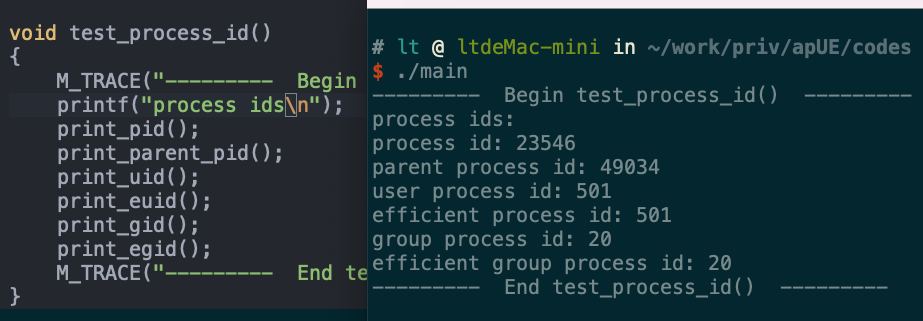
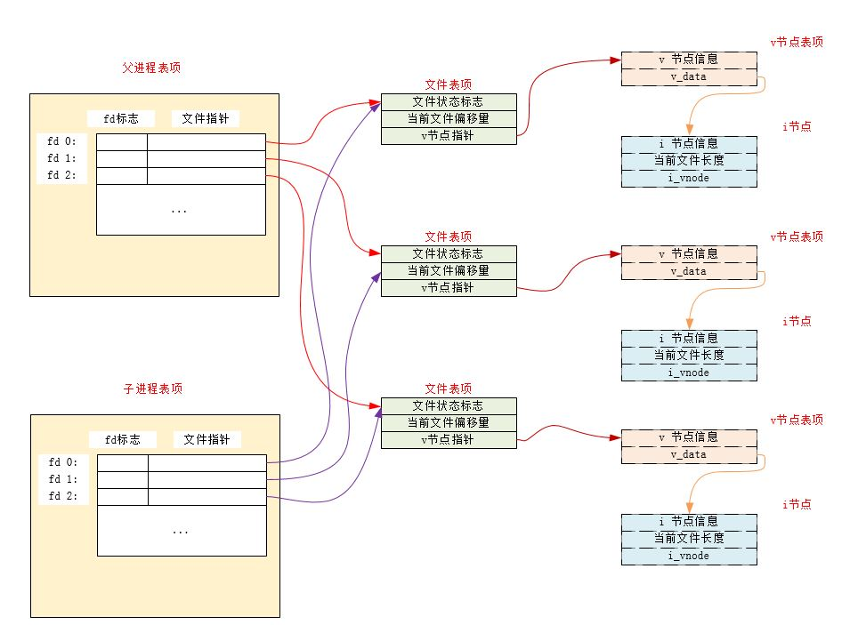
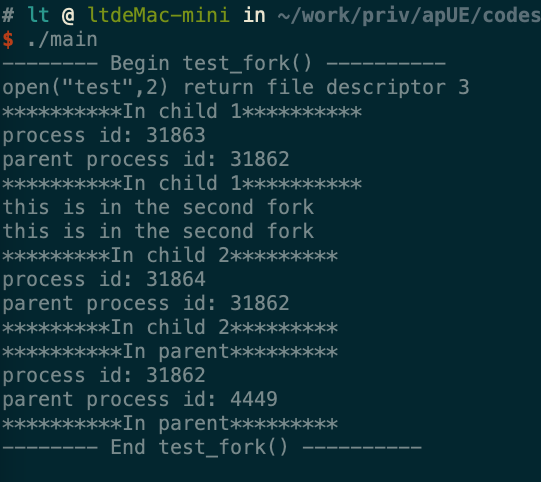

# 进程控制

## 进程的创建

1. 每个进程都有一个非负整型表示的唯一进程 ID 。
    - 所谓的唯一，即当前正在系统中运行的所有进程`ID` 各不相同。
    - 当一个进程`A`终止后，它的进程`ID`可以复用
        - 大多数UNIX系统实现的是延迟复用算法，使得新进程`B`的`ID`不同于最近终止的进程`A`的`ID`
    - 系统中有一些专用的进程
        - `ID`为 0 的进程通常是调度进程，也称作交换进程。该进程是操作系统的一部分，并不执行任何磁盘上的程序，因此称作是系统进程
        - `ID`为 1 的进程通常是`init`进程，在自举过程结束时由内核调用
            - 该进程对应的程序文件为`/etc/init`，在较新的版本中是`/sbin/init`文件
            - 该进程负责在自举内核后启动一个 UNIX 系统
            - 该进程通常读取与系统有关的初始化文件（`/etc/rc*`文件，`/etc/inittab`文件以及`/etc/init.d`中的文件），并经系统引导到一个状态
            - 该进程永远不会终止
            - 该进程是一个普通的用户进程（不是内核中的系统进程），但是它以超级特权运行

2. 获取进程的标识符：

    ```
    #include <unistd.h>
    pid_t getpid(void);     //返回值：调用进程的进程 ID
    pid_t getppid(void);    //返回值：调用进程的父进程 ID
    pid_t getuid(void);     //返回值：调用进程的实际用户 ID
    pid_t geteuid(void);    //返回值：调用进程的有效用户 ID
    pid_t getgid(void);     //返回值：调用进程的实际组 ID
    pit_t getegid(void);    //返回值：调用进程的有效组 ID
    ```
    - 这些函数都没有出错返回

3. 示例：在`main`函数中调用`test_process_id`函数：
    
    ```
    void test_process_id()
    {
        M_TRACE("---------  Begin test_process_id()  ---------\n");
        printf("process ids\n");
        print_pid();
        print_parent_pid();
        print_uid();
        print_euid();
        print_gid();
        print_egid();
        M_TRACE("---------  End test_process_id()  ---------\n\n");
    }
    ```
    

4. `fork`函数：创建一个新进程

    ```
    #include <unistd.h>
    pid_t fork(void);
    ```
    
    - 返回值：
        - 成功：
            - 子进程返回 0
            - 父进程返回子进程`ID`
        - 失败：返回 -1

    注意：
    - 如果`fork`调用成功，则它被调用一次，但是返回两次。两次返回的区别是：子进程的返回值是 0，父进程的返回值是新建子进程的进程`ID`
        - 子进程返回值是 0 的理由：一个进程总可以通过`gitpid`知道它的进程`ID`，通过`getppid`知道它的父进程的`ID`
        - 父进程返回值是子进程的进程`ID`的理由是：一个进程的子进程可以有多个，但是并没有函数可以获取它的子进程的`ID`
    - 子进程是父进程的一份一模一样的拷贝，如子进程获取了父进程的数据空间、堆、栈的副本。
        - 父子进程共享正文段（因为正文段是只读的）
        - 父子进程并不共享这些数据空间、堆、栈
    - 子进程和父进程都从`fork`调用之后的指令开始执行。也就是子进程从出生开始，就跟父进程处于同样的状态
    - 由于创建子进程的目的通常为了完成某个任务，因此`fork`之后经常跟随`exec`，所以很多操作系统的实现并不执行一个父进程数据段、堆和栈的完全拷贝，而是使用写时赋值技术（`copy-on-write:COW`）。
        - 这些区域由父进程和子进程共享，而且内核将他们的访问权限改变为只读
        - 如果父子进程中有一个试图修改这些区域，则内核只为修改区域的那块内存制作一个副本
    - 通常`fork`之后，是父进程先执行还是子进程先执行是不确定的，这取决于内核所使用的进程调度算法
    - 注意标准`IO`库的跨`fork`行为。由于标准`IO`库是带缓冲的，因此在`fork`调用之后，这些缓冲的数据也被拷贝到子进程中
    - 父进程的所有打开文件的文件描述符都被复制到子进程中。父进程和子进程每个相同的打开描述符共享同一个文件表项
        - 更重要的是：父进程和子进程共享同一个文件偏移量
        - 如果父进程和子进程写同一个描述符指向的文件，但是又没有任何形式的同步，则它们的输出会相互混合
            - 如果父进程`fork`之后的任务就是等待子进程完成，而不做任何其他事情，则父进程和子进程无需对打开的文件描述符做任何处理。因为只有子进程处理文件
            - 如果父进程`fork`之后，父进程和子进程都有自己的任务处理，则此时父进程和子进程需要各自关闭它们不需要使用的文件描述符，从而避免干扰对方的文件操作
    

    - 除了打开的文件描述符之外，子进程还继承了父进程的下列属性：实际用户`ID`、实际组`ID`、有效用户`ID`、有效组`ID`、附属组`ID`、进程组`ID`、会话`ID`、控制终端、设置用户`ID`标志和设置组`ID`标志、当前工作目录、根目录、文件模式创建屏蔽字、信号屏蔽和信号处理、对任一打开文件描述符的执行时关闭标志、环境、连接的共享存储段、存储映象、资源限制。
    - 父进程和子进程的区别：
        - `fork`返回值不同
        - 进程`ID`不同
        - 子进程的`tms_uitme,tms_stime,tms_cutime,tms_ustime`的值设置为 0
        - 子进程不继承父进程设置的文件锁
        - 子进程的未处理闹钟被清除
        - 子进程的未处理信号集设置为空集
    - `fork`失败的两个主要原因：
        - 系统已有太多的进程
        - 实际用户`ID`的进程总数超过了系统限制（`CHILD_MAX`规定了每个实际用户`ID`在任何时刻拥有的最大进程数）

5. 示例：在`main`函数中调用`test_fork`函数：
    
    ```
    void test_fork()
    {
        M_TRACE("-------- Begin test_fork() ----------\n");
        assert(prepare_file("test", "abc", 3, S_IRWXU) == 0);
        int fd = My_open("test", O_RDWR);
        if ( -1 == fd )
        {
            un_prepare_file("test");
            M_TRACE("-------- End test_fork() --------\n\n");
            return ;
        }
        //**********打开文件成功***********/
        pid_t id = fork();
        if( 0 == id )
        {
            //child 1
            process_func(fd, "**********In child 1**********");
            _exit(0);
        }
        sleep(2);  //确保父进程在子进程之后执行
        id = fork();
        printf("this is in the second fork\n");
        if (0 == id)
        {
            //child 2
            process_func(fd, "*********In child 2*********");
            _exit(0);
        }
        sleep(2);
        process_func(fd,"**********In parent*********");
        close(fd);
        un_prepare_file("test");
        M_TRACE("-------- End test_fork() ----------\n\n");
    }
    ```
    
    

    可以看出：
    - 子进程和父进程的顺序不确定
    - 由于标准`IO`库是带缓冲的，因此在`fork`调用之后，这些缓冲的数据也被拷贝到子进程中，因此`"this is in the sencond fork"` 被输出两次。

6. `fork`有两种用法：
    - 父进程希望复制自己，是父进程和子进程同时执行不同的代码段。在网络服务中很常见：父进程等待请求，然后调用`fork`并使子进程处理请求
    - 父进程要执行一个不同的程序。在`shell`是很常见。此时子进程从`fork`返回之后立即调用`exec`
