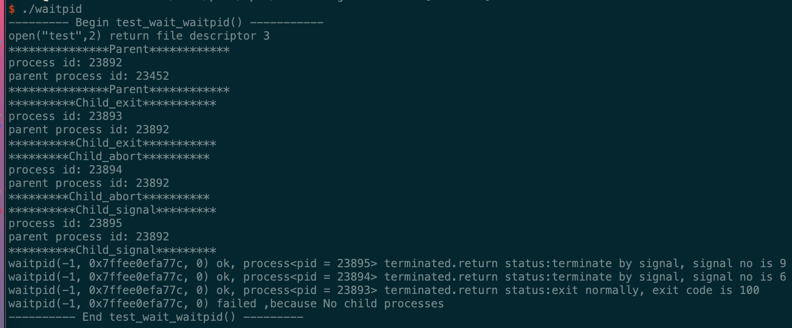
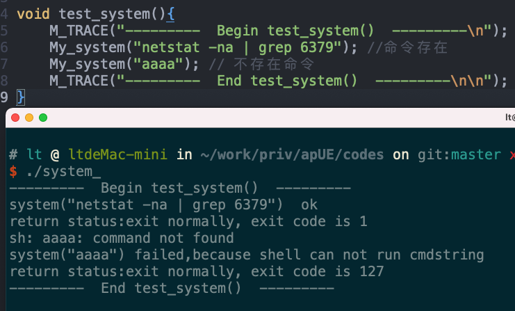
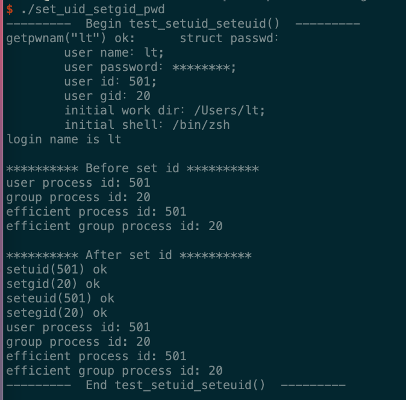
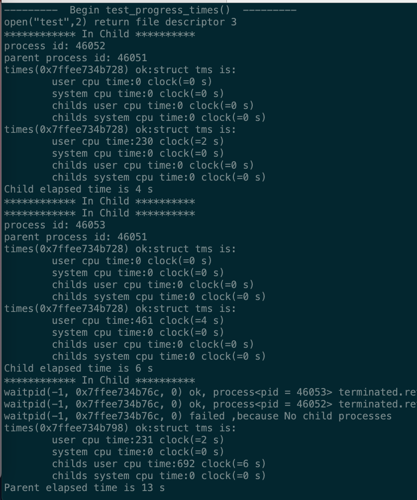
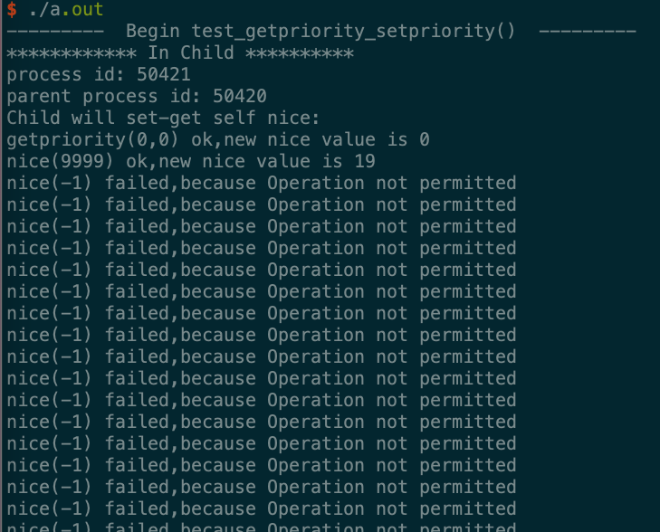
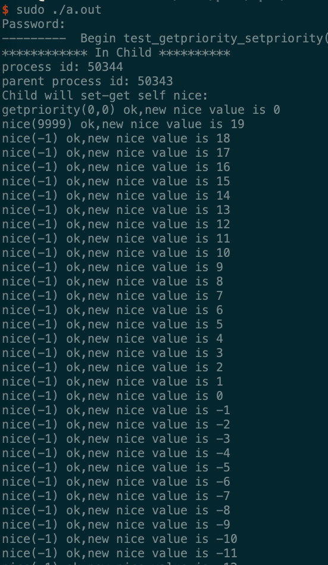

# 进程控制

## 进程的创建

1. 每个进程都有一个非负整型表示的唯一进程 ID 。
    - 所谓的唯一，即当前正在系统中运行的所有进程`ID` 各不相同。
    - 当一个进程`A`终止后，它的进程`ID`可以复用
        - 大多数UNIX系统实现的是延迟复用算法，使得新进程`B`的`ID`不同于最近终止的进程`A`的`ID`
    - 系统中有一些专用的进程
        - `ID`为 0 的进程通常是调度进程，也称作交换进程。该进程是操作系统的一部分，并不执行任何磁盘上的程序，因此称作是系统进程
        - `ID`为 1 的进程通常是`init`进程，在自举过程结束时由内核调用
            - 该进程对应的程序文件为`/etc/init`，在较新的版本中是`/sbin/init`文件
            - 该进程负责在自举内核后启动一个 UNIX 系统
            - 该进程通常读取与系统有关的初始化文件（`/etc/rc*`文件，`/etc/inittab`文件以及`/etc/init.d`中的文件），并经系统引导到一个状态
            - 该进程永远不会终止
            - 该进程是一个普通的用户进程（不是内核中的系统进程），但是它以超级特权运行

2. 获取进程的标识符：

    ```
    #include <unistd.h>
    pid_t getpid(void);     //返回值：调用进程的进程 ID
    pid_t getppid(void);    //返回值：调用进程的父进程 ID
    pid_t getuid(void);     //返回值：调用进程的实际用户 ID
    pid_t geteuid(void);    //返回值：调用进程的有效用户 ID
    pid_t getgid(void);     //返回值：调用进程的实际组 ID
    pit_t getegid(void);    //返回值：调用进程的有效组 ID
    ```
    - 这些函数都没有出错返回

3. 示例：在`main`函数中调用`test_process_id`函数：
    
    ```
    void test_process_id()
    {
        M_TRACE("---------  Begin test_process_id()  ---------\n");
        printf("process ids\n");
        print_pid();
        print_parent_pid();
        print_uid();
        print_euid();
        print_gid();
        print_egid();
        M_TRACE("---------  End test_process_id()  ---------\n\n");
    }
    ```
    

4. `fork`函数：创建一个新进程

    ```
    #include <unistd.h>
    pid_t fork(void);
    ```
    
    - 返回值：
        - 成功：
            - 子进程返回 0
            - 父进程返回子进程`ID`
        - 失败：返回 -1

    注意：
    - 如果`fork`调用成功，则它被调用一次，但是返回两次。两次返回的区别是：子进程的返回值是 0，父进程的返回值是新建子进程的进程`ID`
        - 子进程返回值是 0 的理由：一个进程总可以通过`gitpid`知道它的进程`ID`，通过`getppid`知道它的父进程的`ID`
        - 父进程返回值是子进程的进程`ID`的理由是：一个进程的子进程可以有多个，但是并没有函数可以获取它的子进程的`ID`
    - 子进程是父进程的一份一模一样的拷贝，如子进程获取了父进程的数据空间、堆、栈的副本。
        - 父子进程共享正文段（因为正文段是只读的）
        - 父子进程并不共享这些数据空间、堆、栈
    - 子进程和父进程都从`fork`调用之后的指令开始执行。也就是子进程从出生开始，就跟父进程处于同样的状态
    - 由于创建子进程的目的通常为了完成某个任务，因此`fork`之后经常跟随`exec`，所以很多操作系统的实现并不执行一个父进程数据段、堆和栈的完全拷贝，而是使用写时赋值技术（`copy-on-write:COW`）。
        - 这些区域由父进程和子进程共享，而且内核将他们的访问权限改变为只读
        - 如果父子进程中有一个试图修改这些区域，则内核只为修改区域的那块内存制作一个副本
    - 通常`fork`之后，是父进程先执行还是子进程先执行是不确定的，这取决于内核所使用的进程调度算法
    - 注意标准`IO`库的跨`fork`行为。由于标准`IO`库是带缓冲的，因此在`fork`调用之后，这些缓冲的数据也被拷贝到子进程中
    - 父进程的所有打开文件的文件描述符都被复制到子进程中。父进程和子进程每个相同的打开描述符共享同一个文件表项
        - 更重要的是：父进程和子进程共享同一个文件偏移量
        - 如果父进程和子进程写同一个描述符指向的文件，但是又没有任何形式的同步，则它们的输出会相互混合
            - 如果父进程`fork`之后的任务就是等待子进程完成，而不做任何其他事情，则父进程和子进程无需对打开的文件描述符做任何处理。因为只有子进程处理文件
            - 如果父进程`fork`之后，父进程和子进程都有自己的任务处理，则此时父进程和子进程需要各自关闭它们不需要使用的文件描述符，从而避免干扰对方的文件操作
    

    - 除了打开的文件描述符之外，子进程还继承了父进程的下列属性：实际用户`ID`、实际组`ID`、有效用户`ID`、有效组`ID`、附属组`ID`、进程组`ID`、会话`ID`、控制终端、设置用户`ID`标志和设置组`ID`标志、当前工作目录、根目录、文件模式创建屏蔽字、信号屏蔽和信号处理、对任一打开文件描述符的执行时关闭标志、环境、连接的共享存储段、存储映象、资源限制。
    - 父进程和子进程的区别：
        - `fork`返回值不同
        - 进程`ID`不同
        - 子进程的`tms_uitme,tms_stime,tms_cutime,tms_ustime`的值设置为 0
        - 子进程不继承父进程设置的文件锁
        - 子进程的未处理闹钟被清除
        - 子进程的未处理信号集设置为空集
    - `fork`失败的两个主要原因：
        - 系统已有太多的进程
        - 实际用户`ID`的进程总数超过了系统限制（`CHILD_MAX`规定了每个实际用户`ID`在任何时刻拥有的最大进程数）

5. 示例：在`main`函数中调用`test_fork`函数：
    
    ```
    void test_fork()
    {
        M_TRACE("-------- Begin test_fork() ----------\n");
        assert(prepare_file("test", "abc", 3, S_IRWXU) == 0);
        int fd = My_open("test", O_RDWR);
        if ( -1 == fd )
        {
            un_prepare_file("test");
            M_TRACE("-------- End test_fork() --------\n\n");
            return ;
        }
        //**********打开文件成功***********/
        pid_t id = fork();
        if( 0 == id )
        {
            //child 1
            process_func(fd, "**********In child 1**********");
            _exit(0);
        }
        sleep(2);  //确保父进程在子进程之后执行
        id = fork();
        printf("this is in the second fork\n");
        if (0 == id)
        {
            //child 2
            process_func(fd, "*********In child 2*********");
            _exit(0);
        }
        sleep(2);
        process_func(fd,"**********In parent*********");
        close(fd);
        un_prepare_file("test");
        M_TRACE("-------- End test_fork() ----------\n\n");
    }
    ```
    
    

    可以看出：
    - 子进程和父进程的顺序不确定
    - 由于标准`IO`库是带缓冲的，因此在`fork`调用之后，这些缓冲的数据也被拷贝到子进程中，因此`"this is in the sencond fork"` 被输出两次。

6. `fork`有两种用法：
    - 父进程希望复制自己，是父进程和子进程同时执行不同的代码段。在网络服务中很常见：父进程等待请求，然后调用`fork`并使子进程处理请求
    - 父进程要执行一个不同的程序。在`shell`是很常见。此时子进程从`fork`返回之后立即调用`exec`

7. `vfork`函数调用序列和返回值与`fork`相同，但是二者语义不同：
    - `vfork`用于创建一个新进程，该新进程的目的是`exec`一个新程序，所以`vfork`并不将父进程的地址空间拷贝到子进程中。
        - `vfork`的做法是：在调用`exec`或者`exit`之前，子进程在父进程的空间中运行。
        > 所以在`exec`或者`exit`之前，子进程可以篡改父进程的数据空间。

    - `vfork`保证子进程优先运行，在子进程调用`exec`或者`exit`之后父进程才可能被调度运行
    > 当子进程调用`exec`或者`exit`中的任何一个时，父进程会恢复运行，在此之前内核会使父进程处于休眠状态。

8. 示例：在`main`函数中调用`test_vfork`函数：

    ```
    void test_vfork()
    {
        M_TRACE("---------- Begin test_vfork ---------\n");
        assert(prepare_file("test","abc", 3, S_IRWXU) == 0);
        int fd = My_open("test", O_RDWR);
        if( -1 == fd )
        {
            un_prepare_file("test");
            M_TRACE("---------- End test_vfork ---------\n");
            return ;
        }
        /*********打开文件成功***********/
        int i = 0;
        int id = vfork();
        if ( 0 == id )
        { //child
            sleep(2);
            fcntl_lock(fd);
            printf("********* In Child *********\n");
            print_pid();
            print_parent_pid();
            printf("i = %d\n",i);
            i = 999;
            printf("********* In Child *********\n");
            fcntl_unlock(fd);
            _exit(0);
        }
        else
        {   //parent
            fcntl_lock(fd);  // 加锁
            printf("*********** In Parent ***********\n");
            print_pid();
            print_parent_pid();
            printf("i=%d\n",i);
            printf("*********** In Parent ***********\n");
            fcntl_unlock(fd); // 解锁
        }
        close(fd);
        un_prepare_file("test");
        M_TRACE("---------- End test_vfork ---------\n");
    }
    ```

    


    可以看出：
    - 子进程调用`_exit(0)`之前，父进程被阻塞；当子进程调用`_exit(0)`之后，父进程才开始执行
    - 子进程共享了父进程的进程空间，且可以访问修改父进程的进程空间

    如果我们通过加锁先获得锁，虽然我们期望父进程先执行（因为父进程先获得锁），但是实际仍然是子进程先执行。
    `vfork`直接让父进程处于未就绪的状态，从而不会去获取记录锁。只有当子进程执行完`_exit(0)`时，父进程才就绪。

## 进程的终止

1. 进程有 8 种方式使进程终止，其中 5 种为正常终止，3 种异常终止：
    - 正常终止方式：
        - 从`main`函数返回，等效于`exit`
        - 调用`exit`函数。`exit`会调用各终止处理函数，然后关闭所有标准`IO`流
        - 调用`_exit`或`_Exit`函数。它们不运行终止处理程序，也不冲洗标准`IO`流
        - 进程的最后一个线程在其启动例程中执行`return`语句。但是该线程返回值不用做进程返回值，该进程以终止状态
          0 返回。
        - 进程的最后一个线程用`pthread_exit`函数。终止状态为 `0`。

    - 异常终止状态
        - 调用 `abort`。
        - 接收到一个信号。
        - 多线程中，最后一个线程对取消请求做出响应。

    更进一步的：
    - 不管进程如何终止，最后都会执行内核中的同一段代码：这段代码为相应进程关闭所打开的描述符（不仅仅是文件描述符），释放它所使用的内存
    - 不管进程如何终止，我们都需要一种方法来通知父进程，本进程是如何终止的
     - 对于`exit,_exit,_Exit`这三种情况：将本进程的退出状态作为参数传给函数，并且在最后调用`_exit`时，内核将退出状态换成终止状态。
     > `exit`函数和`_Exit`函数最终调用的是`_exit`函数
     - 对于异常终止情况，内核产生一个指示异常终止原因的终止状态

     在任意一种情况下，终止进程的父进程都能够用`wait`和`waitpid`函数取得终止状态。然后父进程能够检测终止状态。如果子进程是
     正常终止，则可以从终止状态中提取出退出状态。

2. 如果父进程在子进程之前终止，那么内核将会该子进程的父进程改为`init`进程，称作由`init`进程收养。其原理为：
    - 在一个进程终止时，内核逐个检查所有活动进程，以判断这些活动进程是否是正要终止的进程的子进程
    - 如果是，则该活动进程的父进程`ID`就改为 1

    这种方式确保了每个进程都有一个父进程

3. 内核为每个终止子进程保存了一定量的信息，所以当终止进程的父进程调用`wait`函数或者`waitpid`函数时，可以得到这些信息
    - 这些信息至少包括：终止进程的进程`ID`，终止进程的终止状态，终止进程的使用CPU时间总量
    - 内核此时可以释放终止进程使用的所有内存，关闭它所有的打开文件。但是该终止进程还残留了上述信息等待父进程处理
    - 我们称一个已经终止、但是等待父进程对它进行善后处理的进程称作僵死进程，在`ps`命令中显示为`Z`
        - 所谓善后处理，就是父进程调用`wait`函数或`waitpid`函数读取终止进程的残留信息
        - 一旦父进程进行了善后处理，则终止进程的所有占用资源（包括残留信息）都得到释放，该进程被彻底销毁
    - 对于`init`超级进程，它被设计成：任何时候只要有一个子进程终止，就立即调用`wait`函数取得其终止状态。这种做法防止了系统中塞满了僵死进程

4.  当一个进程终止时，内核就向其父进程发送`SIGCHLD`信号。这种信号是一个异步信号，因为该信号可能在任何时间发出
    - 父进程可以选择忽略此信号。这是系统的默认行为
    - 父进程也可以针对此信号注册一个信号处理程序，从而当接收该信号时调用相应的信号处理程序

5. `wait/waitpid`函数：
    ```
    #include <sys/wait.h>
    pid_t wait(int *staloc);
    pid_t waitpid(pid_t pid, int *staloc, int options);
    ```

    - 参数：
        - `staloc`：存放子进程终止状态的缓冲区地址。如果你不关心子进程的终止状态，则可以设它为空指针`NULL`
        
        对于`waitpid`函数：
        - `pid`：
            - 如果`pid == -1`：则等待任意一个子进程终止
            - 如果`pid > 0`：则等待进程`ID`等于`pid`的那个子进程终止
            - 如果`pid == 0`：则等待组`ID`等于调用进程组`ID`的任一子进程终止
            - 如果`pid < 0`：等待组`ID`等于`pid`绝对值的任一子进程终止
        - `options`：或者是 0 ，或者是下列常量按位或的结果：
            - `WNOHANG`：没有指定的子进程终止时，并不阻塞程序的执行。
            - `WUNTRACED`：执行作业控制。若操作系统支持作业控制，则由`pid`指定的任一子进程在停止后已经继续，但
            其状态尚未报告，则返回其状态
            - `WCONTINUED`：执行作业控制。若操作系统支持作业控制，则由`pid`指定的任一子进程已处于停止状态，并且
            其状态自停止以来尚未报告过，则返回其状态。
            > 进程的停止状态：类似于暂停。它不同于终止状态。

    - 返回值：
        - 成功：返回终止子进程的进程`ID`
        - 失败：返回 0 或 -1

    注意：

    - `wait`的语义是等待任何一个子进程终止：
        - 如果当前进程的所有子进程还在运行，则阻塞
        - 如果有一个子进程已终止，正在等待父进程获取其终止状态，则当前进程取得该子进程的终止状态并立即返回
        - 如果当前进程没有任何子进程，则立即出错返回

    - `waitpid`的语义是等待指定的子进程终止：
        - 如果当前进程的所有子进程都在运行：
            - 如果`options`指定为`WNOHANG`，则`waitpid`并不阻塞，而是立即返回 0
            - 如果`options`未指定为`WNOHANG`，则`waitpid`阻塞

        - 如果指定`pid`的子进程已终止，正在等待父进程获取其终止状态，则当前进程取得该子进程的终止状态并立即返回
        - 如果指定的`pid`有问题（如不存在，或者不是当前进程的子进程），则立即出错返回

    - 对于出错的情况：
        - `wait`出错的原因是：
            - 调用进程没有子进程
            - 函数调用（正在阻塞中）被一个信号中断
        - `waitpid`出错的原因是：
            - 指定的进程或进程组不存在
            - `pid`指定的进程不是调用进程的子进程
            - 函数调用（正在阻塞中）被一个信号中断

    - 可以通过宏从终止状态中取得退出状态以及终止原因等：
        - `WIFEXITED(status)`：如果子进程正常终止，则为真。此时可以执行`WEXISTSTATUS(status)`获取子进程的退出状态的低 8 位
        - `WIFSIGNALED(status)`：如果子进程异常终止，则为真。此时可以执行`WTREMSIG(status)`获取使得子进程终止的信号编号
        - `WIFSTOPPED(status)`：如果子进程的当前状态为暂停，则为真。此时可执行`WSTOPSIG(status)`获取使得子进程暂停的编号
        - `WIFCONTINUED(status)`：如果子进程在暂停后已经继续执行了，则为真。


6. 示例：在`main`函数中调用`test_wait_waitpid`函数：
    ```
    void test_wait_waitpid()
    {
        M_TRACE("--------- Begin test_wait_waitpid() -----------\n");
        assert(prepare_file("test", "abc", 3, S_IRWXU) == 0);
        int fd = My_open("test", O_RDWR);
        if( -1 == fd )
        {
            un_prepare_file("test");
            M_TRACE("--------End test_fork() ------------\n\n");
            return ;
        }
        //打开文件成功
        process_func(fd, "***************Parent************");
        if( 0 != child_exit(fd, 100) )
        {   //parent
            sleep(1);  //确保父进程稍后执行
            if ( 0 != child_abort(fd) )
            {   //parent
                sleep(1);  //确保父进程稍后执行
                if ( 0 != child_signal(fd) )
                {    //parent
                    sleep(1);//确保父进程稍后执行
                    check_wait();  //only wait at parent
                    //check_waitpid(); //only wait at parent
                    close(fd);
                    un_prepare_file("test");
                    M_TRACE("---------- End test_wait_waitpid() ---------\n\n");
                }

            }
        }
    }
    ```

    

    - 子进程的结束顺序是跟它们派生的顺序没有什么关系。`wait`只会处理最先结束的子进程
    - 调用了`_exit`的子进程，属于正常终止；调用了`abort`和被信号终止的子进程属于异常终止

    如果我们使用 `check_waitpid()`，则结果如下：

    

    - 通过`waitpid`可以严格控制取得终止子进程状态的顺序
    - 通过`waitpid`依次等待所有的子进程，可以确保父进程是最后一个结束的


7. `waitid`函数：它类似`waitpid`，但是提供了更灵活的参数

    ```
    #include<sys/wait.h>
    int waitid(idtype_t idtype, id_t id, siginfo_t *infop, int options);
    ```

    - 参数：
        - `idtype`：指定了`id`类型，可以为下列常量：
            `P_PID`：等待一特定进程：id包含要等待子进程的进程ID
            `P_PGID`：等待一特定进程组中的任一子进程：id包含要等待子进程的进程组ID
            `P_ALL`：等待任一子进程：忽略id

        - `id`：指定的进程`id`或者进程组`id`
        - `infop`：一个缓冲区的地址。该缓冲区由`waitid`填写，存放了造成子进程状态改变的有关信号的详细信息
        - `options`：指示调用者关心哪些状态变化。可以是下列常量的按位或：
            - `WCONTINUED`：等待这样的子进程：他以前曾被停止过，此后又继续执行，但是其状态尚未报告
            - `WEXITED`：等待已退出的进程
            - `WHOHANG`：如无可用的子进程退出状态，立即返回而非阻塞
            - `WNOWAIT`：不破坏进程退出状态。该子进程退出状态可由后续的
              `wait`、`waitid` 或`waitpid`调用取得
            - `WSTOPPED`：等待一进程，它已经停止，但其状态尚未报告

    - 返回值：
        - 成功：返回 0
        - 失败：返回 -1

8. 函数`wait3`和`wait4`：可以返回由终止进程及其所有子进程使用的资源概况

    ```
    #include<sys/types.h>
    #include<sys/wait.h>
    #include<sys/time.h>
    #include<sys/resource.h>

    pid_t wait3(int *staloc, int options, struct rusage *rusage );
    pid_t wait4(pid_t pid, int *staloc, int options, struct rusage *rusage);

    ```

    - 参数：
        - `staloc`：存放子进程终止状态的缓冲区的地址。如果你不关心子进程的终止状态，则可以设置为空指针`NULL`
        - `rusage`：一个缓冲区地址，该缓冲区存放的是终止子进程的资源统计信息，包括：用户CPU时间总量、系统CPU
        时间总量、缺页次数、接受到信号的次数。

        其他的和`waitpid`一样

    - 返回值：
        - 成功：返回终止子进程的进程`ID`
        - 失败：返回 -1

9. 如果`fork`之后的逻辑依赖于父进程还是子进程先执行，则产生了竞争条件。
    - 可以使用进程间通信机制解决这类竞争问题

## exec

1.  当进程调用一直`exec`函数时，该进程执行的程序完全替换成新程序，而新程序则从`main`函数开始执行
    - 调用`exec`前后，进程`ID`并未改变。因为`exec`并不创建新进程。
    - `exec`只是用磁盘上的一个新程序替换了当前进程的正文段、数据段、堆段和栈段。

2. 有7种不同的`exec`函数可以供使用，它们被统称做`exec`函数

    ```
    int execl(const char *pathname, const char *arg0, ... /* (char *)0 */ );
    int execv(const char *pathname, char *const argv[]);
    int execle(const char *pathname, const char *arg0, ... /* char *)0, char
        *const envp[] */);
    int execve(const char *pathname, char *const argv[], char *const envp[]);
    int execlp(const char *filename, const char *arg0, ... /* (char *)0 */);
    int execvp(const char * filename, char * const argv[]);
    int fexecve(int fd, char *const argv[], char *const envp[]);
    ```

    返回值：
        - 若失败：返回 -1
        - 若成功：不返回

    这几个函数的区别：
    - 前4个函数取路径名作为参数；后两个函数取文件名作为参数；最后一个取文件描述符做参数
        - 若`filename`中包含`/`，则视为路径名
        - 若`filename`不包含`/`，则按照`path`环境变量指定的各个目录中搜寻可执行文件

    - 函数`execl/execle/excelp`要求将新程序每个命令行参数都说明为一个单独的参数，这种参数表以空指针结尾；
    函数`execv,execve/execvp/fexecve`应先构造一个指向各参数的指针数组，然后将该指针数组的地址作为参数
        - `l` 表示列表`list`
        - `v` 表示矢量`vector`
        - `l` 形式中，必须以空指针结尾，否则新程序根本不知道要读取多少个参数。空指针就是命令行参数序列终止的标记
        - `v` 形式中，数组的最后一个元素必须是空指针，否则报错

    - 以`e`结尾的`execle/execve/fexecve`可以传递一个指向环境字符串指针数组的指针。注意这个数组的最后一个元素必须是
    空指针，否则报错。其他四个函数则使用调用进程的`environ`变量为新程序复制现有的环境。

    注意：
    - 操作系统对参数表和环境表的总长度有一个限制，在`POSIX`中，这个值至少是 4096 字节
    - 执行`exec`之后，新程序的进程ID不变，进程的大多数属性不变。但是对打开文件的处理要注意：
        - 进程中每个打开的文件描述符都有一个执行时关闭标志。若设置了此标志，则执行`exec`时会关闭该文件描述符；否则该文件
        描述符仍然保持打开。系统默认行为是不设置执行时关闭标志。
    - 执行`exec`之后，进程的实际用户 ID 和实际组 ID 不变，但是进程的有效用户ID要注意：
        - 进程的有效用户ID和有效组ID是否改变取决于所执行程序文件的设置用户 ID和设置组ID 位是否设置。
            - 若程序文件的设置用户ID位已设置，则进程的有效用户ID变成程序文件所有者的ID;否则有效用户 ID 不变
            - 若程序文件的设置组 ID 位已设置，则进程的有效组 ID 变成程序文件所有组的 ID；否则有效组 ID 不变
    - 在很多UNIX操作系统中，这7个函数只有`execve`是内核的系统调用函数。另外 6 个只是库函数。他们最终都要调用该系统调用
    

4. `PATH` 环境变量包含了一张目录表，称作路径前缀。目录之间用冒号`:`分隔。如`PATH=/bin:/usr/bin:.`
    - `.`表示当前目录
    - 零长前缀也表示当前目录。在起始处，零长前缀为`:xxx`，在中间，零长前缀为`xxx::xxx`，在行尾，零长前缀为`xxxx:`

5. 基本的进程控制原语：
    - `fork`创建进程
    - `exec`初始化执行的新的程序
    - `exit`终止进程
    - `wait`等待子进程终止

6. `exec`不仅仅可以执行二进制可执行文件，也可以执行解释器可执行文件。
    - 解释器可执行文件是文本文件，其首行格式为：
    ```
    #! /bin/sh
    ```
    其中`/bin/sh`(或者其他路径)通常是绝对路径，对它不进行任何特殊的处理

    - 实际上`exec`执行的并不是解释器文件（它是个文本），而是由`/bin/sh`指定的二进制可执行文件，然后`/bin/sh`以该解释器文件作为
    参数
    - 对解释器可执行文件的识别是由操作系统内核来完成。该识别步骤是作为`exec`系统调用处理的一部分来完成的
    - 注意该解释器文件必须要有可执行权限。可以通过`chmod a+x`添加任意用户的可执行权限

7. `system`函数：在程序中执行一个命令字符串

    ```
    #include<stdlib.h>
    int system(const char *cmdstring);
    ```

    - 参数：
        - `cmdstring`：命令字符串（在`shell`中执行），如`ps -aux`
    - 返回值：
        - 有三种返回值。见下面描述
    
    `system`用于将一个字符串作为命令来执行。它等同于同时调用了`fork/exec/waitpid`。有三种返回值：
    - `fork`失败或`waitpid`返回除了`EINTR`之外的错误，则`system`返回 -1，并且设置`errno`以指示错误类型
    - 如果`exec`失败（表示不能执行`shell`），则其返回值如同`shell`执行了`exit(127)`一样
    - 如果三个函数都执行成功，则`system`返回值是`shell`的终止状态，其格式在`waitpid`中说明。

    `system`对系统依懒性很强。目前在`unix`操作系统上，`system`总是可用的。如果`cmdstring`是空指针，则如果`system`返回 0 
    表示操作系统不支持`system`函数；否则支持。

    `system`相较于`fork+exec`的优点是：`system`进行了所需的各种出错处理以及各种信号处理。缺点是：一旦调用`system`的进程
    具有超级用户权限，则`system`执行的命令也具有超级用户权限。
    > 因为`system`的实现过程中并没有更改有效用户ID和实际用户ID的操作。

    >- 因此如果一个进程以特殊的权限运行，而它又想生成另一个程序，则它应该直接使用`fork+exec`并且在`fork`之后，`exec`之前改回普通权限。

    >- 设置用户`ID`和设置组`ID`程序绝不应该调用`system`函数

8. 示例：在`main`函数中同时调用`test_system`函数：

    ```
    void test_system()
    {
        M_TRACE("---------  Begin test_system()  ---------\n");
        My_system("ps -ef | grep 6379"); //命令存在
        My_system("aaaaa"); // 不存在命令
        M_TRACE("---------  End test_system()  ---------\n\n");
    }
    ```
    注意：调用`system`后不再需要调用`wait`等进程控制原语了，这一切控制由`system`打包

    


## 更改用户ID和更改组ID

1. 在设计应用程序时，应该使用最小特权模型：程序应当只具有为完成给定认定所需的最小特权
    - 当进程需要增加特权或需要访问当前并不允许访问的资源时，我们需要更换自己的用户ID或者组ID，是的新ID具有合适的特权或者访问权限
    - 当前进程需要降低其特权或者阻止对某些资源的访问时，也需要更换用户ID或者组ID，新ID不具有相应的特权
    - 进程大部分时候都是最低特权运行。只有到了必要的时候提升特权访问资源，一旦资源访问完毕立即降低特权

2. `setuid/setgid`函数：设置实际用户`ID`和有效用户`ID` / 实际组`ID`和有效组`ID`

    ```
    #include <unistd.h>
    int setuid(uid_t uid);
    int setgid(gid_t gid);
    ```

    - 参数：
        - `uid`：待设置的用户`ID`
        - `gid`：待设置的组`ID`

    - 返回值：
        - 成功：返回 0
        - 失败：返回 -1

    设置的规则为：
    - 如果进程具有超级用户特权，则`setuid`函数将实际用户`ID`，有效用户`ID`以及保存的设
    置用户`ID`(`saved set-user-ID`)全部设置为`uid`（此时`uid`没有限制）
    - 如果进程没有超级用户特权，但是`uid`等于实际用户`ID`或者保存的设置用户`ID`，则`setuid`只会将有效用户`ID`设置为`uid`，不改变
    实际用户`ID`和保存的设置用户`ID`
    - 如果上面两个条件都不满足，则`errno`设置为`EPERM`并返回 -1
    - 上述讨论中，假设`_POSIX_SAVED_IDS`为真。如果为提供此功能，则对于保存的设置用户`ID`部分都无效
    - 针对`setgid`的讨论类似`setuid`
    
3. 操作系统内核为每个进程维护 3 个用户`ID`：实际用户`ID`、有效用户`ID`、保存的设置用户`ID`:
    - 只有超级用户进程可以更改实际用户`ID`
        - 通常是实际用户`ID`是在用户登录时，由`login`程序设置的，而且绝不会改变它。`login`是一个超级用户进程，当它调用`setuid`时，
        设置所有的 3 个用户`ID`
    - 仅当对程序文件设置了用户`ID`时，`exec`函数才设置有效用户`ID`。如果程序文件的设置用户`ID`位没有设置，则`exec`函数不会改变
    有效用户`ID`，而是维持其现有值
        - 任何时候都可以调用`setuid`将有效用户`ID`设置为实际用户`ID`或者保存的设置用户`ID`
        - 调用`setuid`时，有效用户`ID`不能随意取值，只能从实际用户`ID`或者保存的设置用户`ID`取值
    - 保存的设置用户`ID`是由`exec`复制有效用户`ID`而得到。如果设置了程序文件的设置用户`ID`位，则`exec`根据文件的用户`ID`设置了
    进程的有效用户`ID`之后，这个副本就保存起来
    - 目前可以通过`getuid`获取进程的当前实际用户`ID`，可以通过`geteuid`获取进程的当前有效用户`ID`，但没有函数获取进程当前的保存的
    设置用户`ID`


4 `POSIX`提供了两个函数：

    ```
    #include <unistd.h>
    int seteuid(uid_t uid);
    int setegid(gid_t gid);
    ```
    - 参数：
        - `uid`：待设置的有效用户`ID`
        - `gid`：待设置的有效组`ID`  
    - 返回值：
		- 成功： 返回 0
		- 失败： 返回 -1

    `seteuid`只修改进程的有效用户`ID`；`setegid`只修改进程的有效组`ID`
    - 如果进程具有超级权限，则`seteuid`将设置进程的有效用户`ID`为`uid`（此时`uid`没有限制）
    - 如果进程没有超级用户权限，则`seteuid`只能将进程的有效用户`ID`设置为它的实际用户`ID`或者保存的设置用户`ID`
    - 针对`setegid`的讨论类似`seteuid`

5. `getlogin`：获取运行该程序的用户登录名

    ```
    #inlcude<unistd.h>
    char *getlogin(void);
    ```
    - 返回值：
        - 成功：返回指向登录名字字符串的指针
        - 返回：返回`NULL`

    通常失败的原因是：进程的用户并没有登录到系统。比如守护进程

6. 示例：在`main`函数中调用`test_setuid_seteuid`函数：

    ```
    void test_setuid_seteuid()
    {
        M_TRACE("---------  Begin test_setuid_seteuid()  ---------\n");
        struct passwd* result=My_getpwnam("huaxz1986");
        if(NULL==result)
        {
            M_TRACE("---------  End test_setuid_seteuid()  ---------\n\n");
            return;
        }

        My_getlogin();
        printf("\n********** Before set id **********\n");
        print_uid();
        print_gid();
        print_euid();
        print_egid();
        printf("\n********** After set id **********\n");
        My_setuid(result->pw_uid); // 二选一
        My_setgid(result->pw_gid); // 二选一
        My_seteuid(result->pw_uid); // 二选一
        My_setegid(result->pw_gid); // 二选一
    //    My_setuid(0); // 二选一
    //    My_setgid(0); // 二选一
    //    My_seteuid(0); // 二选一
    //    My_setegid(0); // 二选一
        print_uid();
        print_gid();
        print_euid();
        print_egid();
        M_TRACE("---------  End test_setuid_seteuid()  ---------\n\n");
    }
	```

    我们首先在普通用户状态下，将那些`ID`都设置成超级用户所属的用户`ID`和组`ID`

    

    然后，我们在超级用户状态下，将那些`id`都设置成普通用户的用户`ID`和组`ID`
	

    可以看到：
	- 普通进程无法将自己的用户`ID`和有效用户`ID`设置为超级用户`root`
	- 超级进程可以设置自己的用户`ID`和有效用户`ID`为任意值，但是无法修改组`ID`和有效组`ID`
	- 另外这里发现，无论在普通用户下还是超级用户下， `getlogin`都调用失败

	另外没有给出的截图是：超级进程一旦将自己的用户ID和有效用户ID设置为普通用户之后，该进程退化为普通进程


## 进程会计
    
1. 大多数`UNIX`系统提供了一个选项以进行会计处理
    - 启用该选项后，每当进程结束时内核就会写一个会计处理
    - 超级用户执行命令`accton pathname`则会启用会计处理，会计记录会写到`pathname`指定的文件中
        - 如果不带文件名参数，会停止会计处理
    - 会计记录文件是个二进制文件，包含的会计记录是二进制数据

2.  会计记录结构定义在`<sys/acct.h>`头文件中。虽然各个操作系统的实现可能有差别，但是基本数据如下：
    
    ```
    typedef u_short comp_t;
    struct acct 
    {
        char ac_flag;   //标记
        char ac_stat;   //终止状态
        uid_t ac_uid;   //真实用户ID
        gid_t ac_gid;   //真实组ID
        dev_t ac_tty;   //控制终端
        time_t ac_btime;    //起始的日历时间
        comp_t ac_utime;    //用户CPU时间
        comp_t ac_stime;    //系统CPU时间
        comp_t ac_etime;    //流逝时间
        comp_t ac_mem;  //平均内存使用
        comp_t ac_io;   //`read`和`write`字节数量
        comp_t ac_rw;   //`read`和`write`的块数
        char ac_comm[8];    //命令名。对应LINUX，则是ac_comm[7]
    };
    ```

    - `ac_flag`记录了进程执行期间的某些事件：
        - `AFORK`：进程是由`fork`产生的，但从未调用`exec`
        - `ASU`：进程使用超级用户特区
        - `ACORE`：进程转储`core`（转储`core`的字节并不计算在会计记录内）
        - `AXSIG`：进程由一个信号杀死
    - 大多数平台上，时间是以时钟滴答数来记录的
    - 会计记录所需的所有数据都由内核保存在进程表中，并在一个新进程被创建初始化
    - 进程终止时，会写一个会计记录。这产生两个后果：
        - 我们不能获取永远不终止的进程的会计记录。因此`init`进程以及内核守护进程不会产生会计记录
        - 在会计文件中记录的顺序对应的是进程终止的顺序，而不是它们的启动的顺序
    - 会计记录对应的进程而不是程序。因此如果一个进程顺序的执行了 3 个程序：`A exec B, B exec C`，
    则只会写一个会计记录。在该记录中的命令名对应于程序`C`，但是`CPU`时间是程序`A,B,C`之和

3. `times`函数：任何进程都可以用该函数获取它自己以及已经终止子进程的运行时间

    ```
    #include <sys/times.h>
    clock_t times(struct tms *buf);
    ```

    - 参数：
        - `buf`：执行`tms`结构的指针。该结构由`times`填写并返回
    - 返回值：
        - 成功：返回流逝的墙上始终时间（以时钟滴答数为单位）
        - 返回：-1

    一个进程可以度量的有 3 个时间：
    - 墙上时钟流逝的时间。从进程从开始运行到结束时钟走过的时间，这其中包含了进程在阻塞和等待状态的时间
    - 用户`CPU`时间：用户进程获得了CPU资源以后，在用户态执行的时间
        > 与用户进程对应的是内核进程
    - 系统`CPU`时间：用户进程获得了CPU资源以后，在内核态的执行时间

        > 进程的三种状态为阻塞、就绪、运行
        >
        >- 墙上时钟流逝时间 = 阻塞时间 + 就绪时间 + 运行时间
        >- 用户CPU时间 = 运行状态下用户空间的时间
        >- 系统CPU时间 = 运行状态下系统空间的时间
        >- 用户CPU时间 + 系统CPU时间 = 运行时间

    `times`函数就是获取进程的这几个时间的。这里`tms`结构定义为：

    ```
    struct tms {
        clock_t tms_utime;  //用户 CPU 时间
        clock_t tms_stime;  //系统 CPU 时间
        clock_t tms_cutime; //终止的子进程用户 CPU 时间的累加值
        clock_t tms_cstime; //终止的子进程系统 CPU 时间的累加值
    }
    ```

    注意：
    - 墙上时钟是相对于过去某个时间刻度量的，所以不能用其绝对值而必须用相对值。通常的用法是：
    调用两次`times`，然后去两次墙上时钟的差值
    - `tms_cutime` 和 `tms_cstime` 包含了`wait`函数族已经等待到的各个子进程的值
    - `clockt_t`可以使用`_SC_CLk_TCK`（用`sysconf`函数）转换成秒数

4. 示例：在`main`函数中调用`test_progress_times`函数：

	```
    void test_progress_times()
    {
        M_TRACE("---------  Begin test_progress_times()  ---------\n");
        assert(prepare_file("test","abc",3,S_IRWXU)==0);
        int fd=My_open("test",O_RDWR);
        if(-1==fd)
        {
            un_prepare_file("test");
            M_TRACE("---------  End test_fork()  ---------\n\n");
            return;
        }
        //****** 打开文件成功 *************//
        clock_t t1,t2;
        struct tms buf;
        t1=times(&buf);
        create_child(fd,1000000000);// 子进程直接 _exit
        create_child(fd,2000000000);// 子进程直接 _exit
        sleep(5);// 让子进程获得锁，否则父进程持有锁，然后等待子进程结束，最后死锁
        fcntl_lock(fd);  // 加锁
        busy_work(1000000000);// 只有父进程能到达这里
        check_waitpid();
        t2=My_times(&buf);
        printf("Parent elapsed time is %d s\n",clock_2_second(t2-t1));\
        fcntl_unlock(fd); // 解锁

        close(fd);
        un_prepare_file("test");
        M_TRACE("---------  End test_progress_times()  ---------\n\n");
    }
	```
    

    该示例的父进程派生了两个子进程。每个子进程都睡眠了 2秒
	- 为了便于观察结果，父进程和子进程都进行了十亿次级别的循环（`busy_work`实现的）。如果没有`busy_work`，则进程的用户CPU时间为0
	- 流逝时间转换成了秒
	- 父进程必须`wait`子进程才能收集子进程的信息。否则父进程的`cstime`和`cutime`均为0
	- 为了防止发生竞争条件，这里使用记录锁。

    可以看到：
	- 当进程睡眠时，只会影响进程的流逝时间，不会影响进程的`utime`和`stime`
	- 进程的流逝时间必须用两次墙上时钟的差值
	- 父进程想要获得子进程的运行时间，必须调用`wait`
	- 父进程获取的子进程的`user cpu time`等于`230+461=691`个时钟滴答，约等于 `691`个时钟滴答。等于 7 秒
	- 父进程获取的子进程的`system cpu time`等于`0`个时钟滴答，等于0 秒。
	- 第一个子进程的运行时间，除了`user cpu time`（等于2秒）之外，还加上睡眠时间（ 2 秒）等于4秒
	- 第二个子进程的运行时间，除了`user cpu time`（等于4秒）之外，还加上睡眠时间（ 2 秒）等于6秒
	- 父进程的运行时间	= 4秒（子进程一运行时间）+6秒（子进程二运行时间）+2秒（父进程的`user cpu time`），一共是 13秒。但是注意到：子进程一的`user cpu time`为 230个时钟滴答， 子进程二的`user cpu time`为 461 个时钟滴答，父进程的`user cpu time`为 231个时钟滴答。这三个时间加在一起应该是  921 个时钟滴答，约 9秒。而我们前面计算是，为 2+5+2=9秒。因此父进程运行时间为 13秒+ 0 秒=13秒
	> 父进程`sleep`时，正好子进程在运行。由于记录锁的存在，时间可以这样累加。


## 进程调度

1. UNIX系统的调度策略和调度优先级是内核决定的。进程可以通过调整`nice`值选择以更低优先级运行
    - 只有特权进程运行提高调度权限
    - `POSIX`实时扩展增加了进一步细调的行为

2. `nice`值得范围是 -20~19 之间。
    - `nice`值越小，优先级越高（该进程抢占能力更强，更霸道）；`nice`值越大，优先级越低（从而该进程是"友好的"）
    - 0 是系统默认的`nice`值

3. `nice`函数：进程通过它来获取自己的`nice`值或修改自己的`nice`值：
    ```
    #include<uinstd.h>
    int nice(int incr);
    ```

    - 参数：
        - `incr`：`nice`值的增量
    - 返回值：
        - 成功：返回新的`nice`值
        - 返回：-1

    `incr`会被增加到调用进程的`nice`值上。
    - 如果`incr`值太大，系统会直接将它降到最大合法值，不会出错（19）。
    - 如果`incr`值太小，系统会直接将它提高到最小合法值，不会出错（-20）。
        - 由于 -1 是合法的返回值。因此在`nice`返回 -1 时，需要综合`errno`才能判断是否出错。
    
4. `getpriority/setpriority`函数：获取/设置进程的`nice`值
    
    ```
    #include<sys/resource.h>
    int getpriority(int which, id_t who);
    int setpriority(int which, id_t who, int value);
    ```

    - 参数：
        - `which`：控制`who`参数是如何解释的。可以取3个值之一：
            - `PRIO_PROCESS`：表示进程
            - `PRIO_PGRP`：表示进程组
            - `PRIO_USER`：表示用户`ID`
        - `who`：选择感兴趣的一个或多个进程
            - 如果`who`为 0 ，`which` 为`PRIO_PROCESS`，返回当前进程的`nice值`
            - 如果`who`为 0 ，`which`为`PRIO_PGRP`，则返回进程组中最小的`nice`值
            - 如果`who`为0，`which`为`PRIO_USER`，则返回调用进程的实际用户`ID`拥有的那些进程中最小的`nice`值
        - `value`：`nice`值的增量

    - 返回值：
        - `getpriority`：
            - 成功：返回`-20~19`之间的`nice`值
            - 失败：返回 -1

    `getpriority`不仅可以获得本进程的`nice`值，还可以获取一组相关进程的`nice`值。而`setpriority`可以为本进程、进程组
    属于特定用户`ID`的所有进程设置优先级

5. 示例：在`main`函数中调用`test_getpriority_setpriority`函数:

	```
    void test_getpriority_setpriority()
    {
        M_TRACE("---------  Begin test_getpriority_setpriority()  ---------\n");
        create_child();
        // 只有父进程能到此处
        check_waitpid();
        My_getpriority(PRIO_PROCESS,0); // 父进程自己的 nice 值
        M_TRACE("---------  End test_getpriority_setpriority()  --------\n\n");
    }
	```
     
	可以看到，如果为普通用户，则没有权限降低`nice`值。因为普通进程没有权限提升其优先级（即降低`nice`值）。在超级用户权限下，结果如下：
	 


